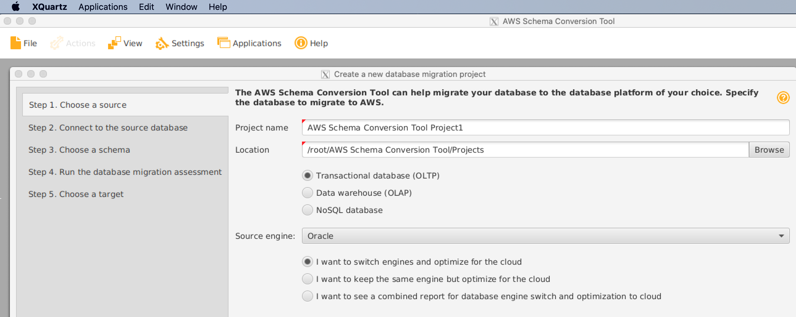

# AWS DMS Terraform module

This terraform module will create a full DMS stack.

The AWS Database Migration Service is used to migrate data from a database (RDS or external) to an RDS instance in the Cloud Platform VPC.

## Pre-requirements

The DMS instance runs behind a NAT, so the _source_ database needs to have its _Public Accessibility_ settings turned on (or the equivalent firewall rule in other environments). Cloud Platform outgoing IPs are published in https://user-guide.cloud-platform.service.justice.gov.uk/documentation/other-topics/ip-filtering.html#nat-gateways

**DMS ONLY MIGRATES DATA, NO PRE-DATA, POST-DATA(CONSTRAINTS), USERS, ROLES, ETC.**

A couple options to also copy DB schema are described further in this document.

**Continuous replication (referred to as CDC in DMS docs), especially between different engines, is a tricky business, see https://docs.aws.amazon.com/dms/latest/userguide/CHAP_Task.CDC.html for details**

Particularly for MS-SQL, Azure databases are not supported and RDS as source needs the settings described in https://aws.amazon.com/premiumsupport/knowledge-center/dms-migrate-rds-sqlserver/

## Usage

For most scenarios, there are only 2 required steps:

 1. Create a kubernetes secret (via `kubectl` or `helm`) in your namespace containing the connection details of both source and destination. See the file example/dms-secret.yaml for the structure.

     * DMS requires username+password authentication, other auth methods are not supported yet

     * Source and destination in the secret are hostnames or IPs

     * TCP ports are usually 1433 for SQLServer, 5432 for Postgres, 3306 for MySQL etc

     * SSL mode has to be one of [none require verify-ca verify-full] see https://registry.terraform.io/providers/hashicorp/aws/latest/docs/resources/dms_endpoint

     * The list of engine names is in the same doc, some are quite exotic, the most used ones will probably be [mysql postgres sqlserver]

 2. Copy the example/dms.tf file to your namespace/resources dir; while lengthy it should just work unmodified.

This module follows the MOJ's standard practices for modules. Team, BU, application and environment are passed down to the module.

The more complex `table_mappings` and `replication_task_settings` options are described in https://docs.aws.amazon.com/dms/latest/userguide/CHAP_Tasks.CustomizingTasks.TaskSettings.html; their use is best decided on a case by case basis.

See the examples for postgres-to-postgres and mssql-to-postgres in the example/ dir; the autogenerated settings if the parameter `replication_task_settings` is empty should work for most tasks.

Replication status can be queried and the task paused/resumed via the API using the output credentials:

```
$ aws dms describe-replication-instances
...
$ aws dms describe-replication-tasks
...
$ aws dms describe-replication-instance-task-logs --replication-instance-arn arn:aws:dms:eu-west-2:11111111:rep:
...
$ aws dms start-replication-task --replication-task-arn arn:aws:dms:eu-west-2:11111111:task: --start-replication-task-type resume-processing
...
$ aws dms delete-replication-task --replication-task-arn
...
```
## Terraform-specific caveats

 1 - a limitation in the provider (as of `hashicorp/aws v3.68.0`) means a change in the migration task settings (`table_mappings` or `replication_task_settings`) without any other changes fails the apply with the unintuitive error "InvalidParameterCombinationException: No modifications were requested on the task". To workaround, also change any other setting around eg a tag.

 2 - task settings are quite verbose and not available as a terraform object, defaults can be seen in the output of `describe-replication-task` and after making any needed edits set with eg `table_mappings = trimspace(file("settings/dms_table_mappings.json"))`; same for `replication_task_settings`

## Engine-specific caveats

 1 - For Postgres in RDS, the _source's_ parameter group need to comply with :
   - rds.logical_replication = 1
   - max_replication_slots > 5

 2 - Azure SQL support is not on par with the SQL Server, significant limitations noticed as of version 3.4.5 of DMS are:
   - AWS DMS doesn't support change data capture operations (CDC) with Azure SQL Database.
   - ValidationSettings are not supported for 'azuredb' endpoint

## Schema migration

This is a one-off step, probably best done post data migration, because the DMS does not ensure a specific order for inserts so foreign key contraints might fail the copy.

Several such tools are available (a complete scenario using Postgresql is described in https://user-guide.cloud-platform.service.justice.gov.uk/documentation/other-topics/aws-rds-migration.html#migrating-an-rds-instance).

The following example will use the AWS Schema Conversion Tool (SCT), because it is freely available and supports several engines.

There is no MacOS app available and it is a graphical app that requires a complicated setup using XQuartz and tricking Mesa.

In batch mode we can use a Docker image based on Ubuntu:

 1. Download the binary (a ~1GB file) from https://d211wdu1froga6.cloudfront.net/builds/1.0/644/Ubuntu/aws-schema-conversion-tool-1.0.zip (latest release 654 didn't work for this test, YMMV)

 2. Download the MS-SQL JDBC from https://docs.microsoft.com/en-us/sql/connect/jdbc/microsoft-jdbc-driver-for-sql-server

 3. Build the image

```
FROM ubuntu:18.04
ENV DEBIAN_FRONTEND=noninteractive
RUN apt-get update && apt-get install -y libx11-6 xdg-utils libxext6 less joe net-tools libgl1-mesa-glx mesa-utils libxslt1.1 libgtk2.0-0
RUN mkdir -p /usr/share/applications && mkdir -p /usr/share/desktop-directories && mkdir -p /root/.local/share/
COPY aws-schema-conversion-tool-1.0.644.deb /tmp/
RUN dpkg -i /tmp/aws-schema-conversion-tool-1.0.644.deb
COPY sqljdbc_6.0.8112.200_enu.tar.gz /tmp/
RUN mkdir -p /usr/local/jdbc-drivers
RUN cd /usr/local/jdbc-drivers && tar xzvf /tmp/sqljdbc_6.0.8112.200_enu.tar.gz
RUN rm -f /tmp/*deb /tmp/*gz  && apt-get clean
ENTRYPOINT ["/opt/aws-schema-conversion-tool/lib/runtime/bin/java","-jar","/opt/aws-schema-conversion-tool/lib/app/AWSSchemaConversionToolBatch.jar"]
```

4. Run with `docker build -t dms-sct .` and

```
2021-09-29 17:57:13.861 [   1]     GENERAL DEBUG   Defining the default application path.
2021-09-29 17:57:14.532 [   1]     GENERAL DEBUG   doc=[#document: null]
2021-09-29 17:57:14.599 [   1]     GENERAL INFO    default_project_settings saved.
2021-09-29 17:57:14.816 [   1]     GENERAL DEBUG   doc=[#document: null]
2021-09-29 17:57:14.821 [   1]     GENERAL INFO    global_settings saved.
2021-09-29 17:57:14.845 [   1]     GENERAL ERROR   Incorrect options!
2021-09-29 17:57:14.845 [   1]     GENERAL INFO    Usage:AmazonMigrationToolConsole.exe create | execute batch_file_path [project_dir_path]
2021-09-29 17:57:14.845 [   1]     GENERAL MANDATORY Log session finished.
```

Config file for the batch command is not generic and outside the scope of this module, this example for Oracle-to-Postgresql describes the general steps: https://docs.aws.amazon.com/prescriptive-guidance/latest/patterns/incrementally-migrate-from-amazon-rds-for-oracle-to-amazon-rds-for-postgresql-using-oracle-sql-developer-and-aws-sct.html; particularly the `run_aws_sct_sql.py` script from that page might be useful.

To run the graphical app on MacOS, setting "Allow connections from network clients" in XQuartz setting and executing

```
docker run -ti -e LIBGL_ALWAYS_INDIRECT=y -e DISPLAY=$(ifconfig en0 | grep inet | awk '$1=="inet" {print $2}'):0 -e XAUTHORITY=/.Xauthority -v /tmp/.X11-unix:/tmp/.X11-unix -v ~/.Xauthority:/.Xauthority --entrypoint /opt/aws-schema-conversion-tool/bin/AWSSchemaConversionTool dms-sct
```

*should* do the trick and you will see the wizard:



<!-- BEGIN_TF_DOCS -->
## Requirements

| Name | Version |
|------|---------|
| <a name="requirement_terraform"></a> [terraform](#requirement\_terraform) | >= 1.2.5 |
| <a name="requirement_aws"></a> [aws](#requirement\_aws) | >= 4.0.0 |
| <a name="requirement_random"></a> [random](#requirement\_random) | >= 3.0.0 |

## Providers

| Name | Version |
|------|---------|
| <a name="provider_aws"></a> [aws](#provider\_aws) | >= 4.0.0 |
| <a name="provider_random"></a> [random](#provider\_random) | >= 3.0.0 |

## Modules

No modules.

## Resources

| Name | Type |
|------|------|
| [aws_dms_replication_instance.replication-instance](https://registry.terraform.io/providers/hashicorp/aws/latest/docs/resources/dms_replication_instance) | resource |
| [aws_dms_replication_subnet_group.replication-subnet-group](https://registry.terraform.io/providers/hashicorp/aws/latest/docs/resources/dms_replication_subnet_group) | resource |
| [aws_iam_policy.irsa](https://registry.terraform.io/providers/hashicorp/aws/latest/docs/resources/iam_policy) | resource |
| [random_id.id](https://registry.terraform.io/providers/hashicorp/random/latest/docs/resources/id) | resource |
| [aws_iam_policy_document.irsa](https://registry.terraform.io/providers/hashicorp/aws/latest/docs/data-sources/iam_policy_document) | data source |
| [aws_subnets.private](https://registry.terraform.io/providers/hashicorp/aws/latest/docs/data-sources/subnets) | data source |
| [aws_vpc.selected](https://registry.terraform.io/providers/hashicorp/aws/latest/docs/data-sources/vpc) | data source |

## Inputs

| Name | Description | Type | Default | Required |
|------|-------------|------|---------|:--------:|
| <a name="input_allocated_storage"></a> [allocated\_storage](#input\_allocated\_storage) | how many GB for local buffer | `number` | `32` | no |
| <a name="input_application"></a> [application](#input\_application) | Application name | `string` | n/a | yes |
| <a name="input_business_unit"></a> [business\_unit](#input\_business\_unit) | Area of the MOJ responsible for the service | `string` | n/a | yes |
| <a name="input_environment_name"></a> [environment\_name](#input\_environment\_name) | Environment name | `string` | n/a | yes |
| <a name="input_infrastructure_support"></a> [infrastructure\_support](#input\_infrastructure\_support) | The team responsible for managing the infrastructure. Should be of the form <team-name> (<team-email>) | `string` | n/a | yes |
| <a name="input_instance_type"></a> [instance\_type](#input\_instance\_type) | replication instance size, e.g dms.t2.medium | `string` | `"dms.t2.medium"` | no |
| <a name="input_is_production"></a> [is\_production](#input\_is\_production) | Whether this is used for production or not | `string` | n/a | yes |
| <a name="input_namespace"></a> [namespace](#input\_namespace) | Namespace name | `string` | n/a | yes |
| <a name="input_team_name"></a> [team\_name](#input\_team\_name) | Team name | `string` | n/a | yes |
| <a name="input_vpc_name"></a> [vpc\_name](#input\_vpc\_name) | VPC name to create security groups in for the ElastiCache and RDS modules | `string` | n/a | yes |

## Outputs

| Name | Description |
|------|-------------|
| <a name="output_irsa_policy_arn"></a> [irsa\_policy\_arn](#output\_irsa\_policy\_arn) | IAM policy ARN for access to the DMS replication instance |
| <a name="output_replication_instance_arn"></a> [replication\_instance\_arn](#output\_replication\_instance\_arn) | Amazon Resource Name (ARN) of the replication instance |
<!-- END_TF_DOCS -->
